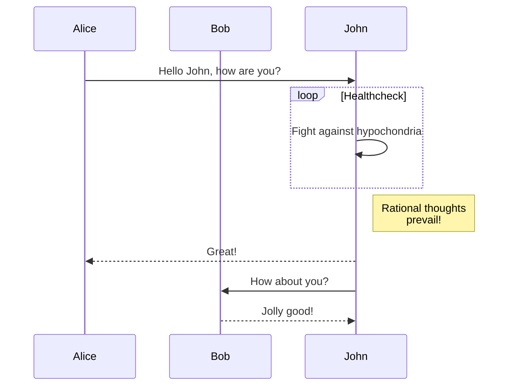

# Mermaid diagram renderer for GitHub 

**NOTE**: [As announced at 2022-02-14](https://github.blog/2022-02-14-include-diagrams-markdown-files-mermaid/),
now GitHub officially supports Mermaid code blocks in Markdown files.
You no longer need to install this Chrome extension in most cases.

An extension for Google Chrome and Chromium to render
[mermaid](https://github.com/mermaid-js/mermaid) diagrams in markdown files in
GitHub (`https://github.com/*`) and GitHub Gist (`https://gist.github.com/*`).

## Features

- The extension renders mermaid code blocks without sending the mermaid code to
  non-GitHub services, which is suitable for private repositories.
- The embedded mermaid version: (mermaid@8.14.0)

## Usage example

The following mermaid code comes from <https://mermaid-js.github.io/mermaid/>.

<table>
 <thead>
  <tr>
   <th>Mermaid code block in markdown</th>
   <th>&rarr;</th>
   <th>Diagram rendered as SVG</th>
  </tr>
 </thead>
 <tbody>
  <tr>
   <td><pre>

</pre></td>
   <td>&rarr;</td>
   <td>

</td>
  </tr>
  <tr></tr>
  <tr>
   <td><pre>

</pre></td>
   <td>&rarr;</td>
   <td>

</td>
  </tr>
 </tbody>
</table>

## Installation

### From the Chrome Web Store

1. Open the store page for [Mermaid diagram renderer for GitHub](https://chrome.google.com/webstore/detail/ahhjfofclhjllmiglebianajpmkabcbc).
1. Click `Add to Chrome`.
1. Open [the test page](/tests/pages/valid.md) to check if the extension works.

### From source code

See [Installation](/docs/development.md#installation) in the development page.

## Development

See the [development](/docs/development.md) page.
