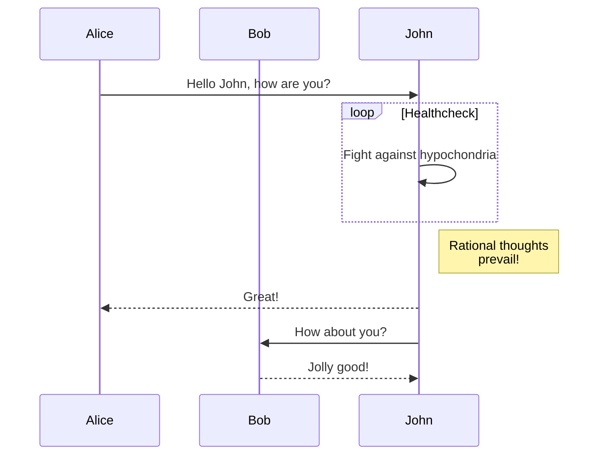
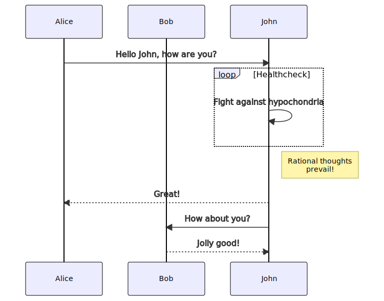

# Mermaid diagram renderer for GitHub 

An extension for Google Chrome and Chromium to render
[mermaid](https://github.com/mermaid-js/mermaid) diagrams in markdown files in
GitHub (`https://github.com/*`) and GitHub Gist (`https://gist.github.com/*`).

## Features

- The extension renders mermaid code blocks without sending the mermaid code to
  non-GitHub services, which is suitable for private repositories and corporate
  data.
- The embedded mermaid version: (mermaid@8.13.4)

## Usage example

The following mermaid code comes from <https://mermaid-js.github.io/mermaid/>.

<table>
 <thead>
  <tr>
   <th>Mermaid code block in markdown</th>
   <th>&rarr;</th>
   <th>Diagram rendered as SVG</th>
  </tr>
 </thead>
 <tbody>
  <tr>
   <td><pre>

</pre></td>
   <td>&rarr;</td>
   <td><p align="center"></p></td>
  </tr>
  <tr></tr>
  <tr>
   <td><pre>

</pre></td>
   <td>&rarr;</td>
   <td><p align="center"></p></td>
  </tr>
 </tbody>
</table>

## Installation

1. Clone this repository.

    ```bash
    git clone https://github.com/tanakafwd/mermaid-diagram-renderer.git
    ```

1. Open `chrome://extensions` in your Google Chrome or Chromium.
1. Enable `Developer mode`.
1. Click `Load unpacked`.
1. Select the [`extension`](/extension) directory in the cloned repository.
1. Open [the test page](/tests/pages/valid.md) to check if the extension works.

## Development

See the [development](/docs/development.md) page.
