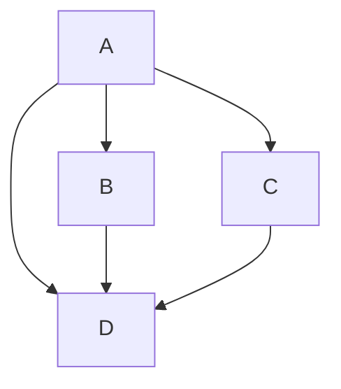
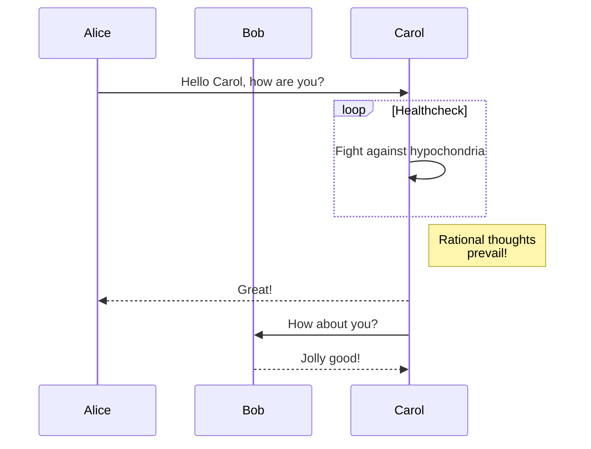
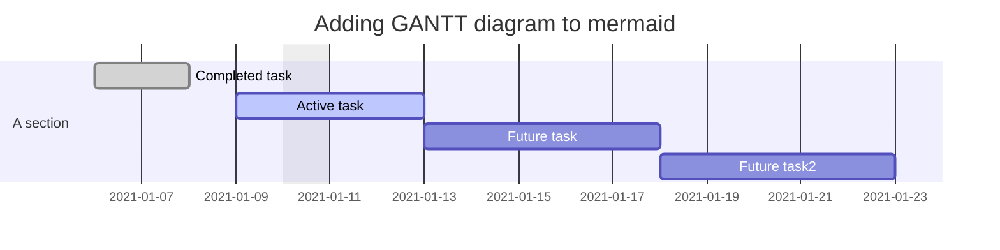
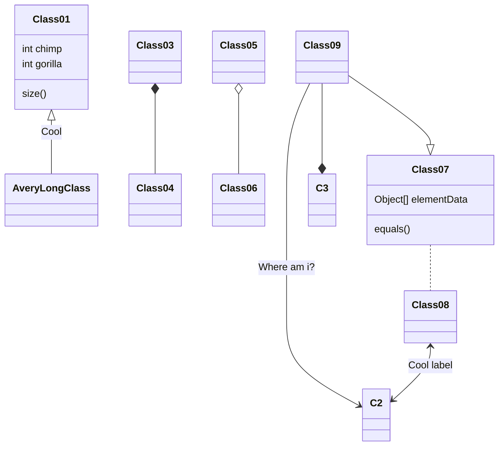
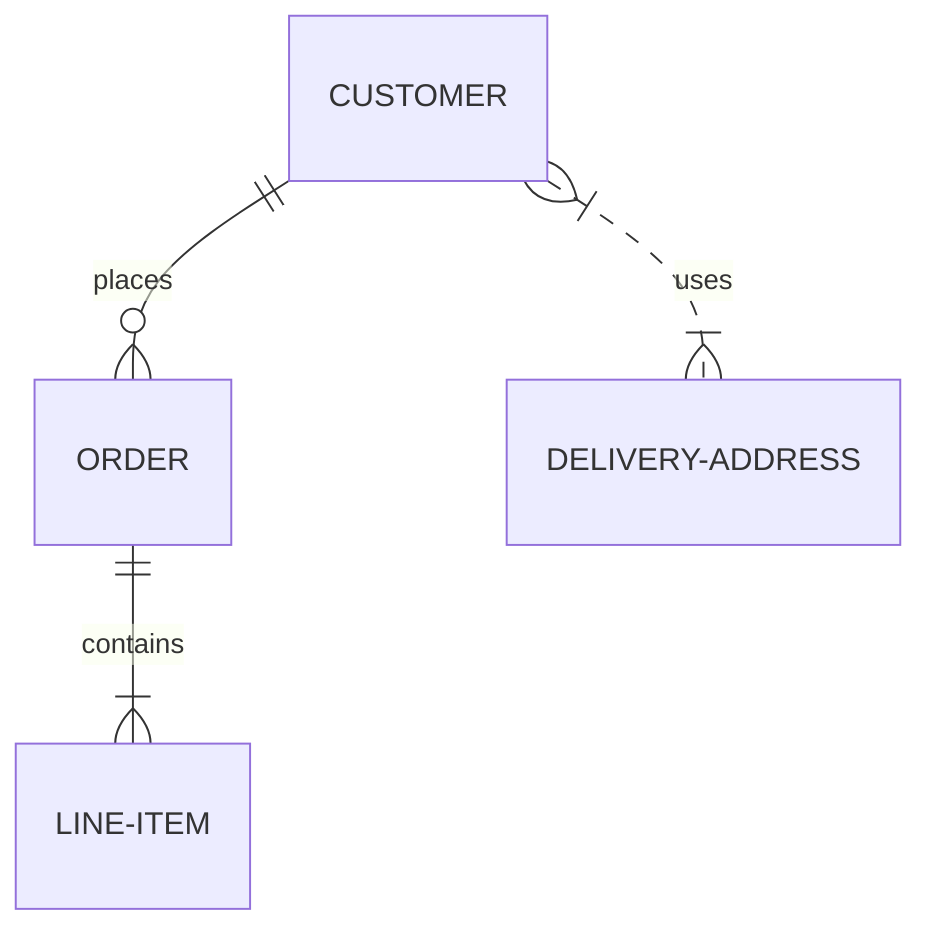
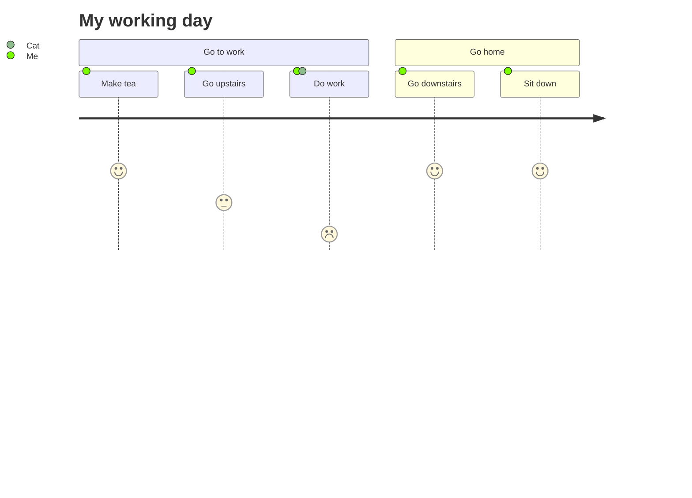

# Test page for valid mermaid code

Test page for <https://github.com/tanakafwd/mermaid-diagram-renderer>.

The following mermaid code comes from <https://mermaid-js.github.io/mermaid/>.

## Flowchart

```
graph TD;
    A-->B;
    A-->C;
    A-->D;
    B-->D;
    C-->D;
```



## Sequence Diagram

```
sequenceDiagram
    participant Alice
    participant Bob
    Alice->>Carol: Hello Carol, how are you?
    loop Healthcheck
        Carol->>Carol: Fight against hypochondria
    end
    Note right of Carol: Rational thoughts <br/>prevail!
    Carol-->>Alice: Great!
    Carol->>Bob: How about you?
    Bob-->>Carol: Jolly good!
```



## Gantt Diagram

```
gantt
dateFormat  YYYY-MM-DD
title Adding GANTT diagram to mermaid
excludes weekdays 2021-01-10

section A section
Completed task            :done,    des1, 2021-01-06,2021-01-08
Active task               :active,  des2, 2021-01-09, 3d
Future task               :         des3, after des2, 5d
Future task2              :         des4, after des3, 5d
```



## Class Diagram

```
classDiagram
Class01 <|-- AveryLongClass : Cool
Class03 *-- Class04
Class05 o-- Class06
Class07 .. Class08
Class09 --> C2 : Where am i?
Class09 --* C3
Class09 --|> Class07
Class07 : equals()
Class07 : Object[] elementData
Class01 : size()
Class01 : int chimp
Class01 : int gorilla
Class08 <--> C2: Cool label
```



## Git Graph - experimental

```
gitGraph:
options
{
    "nodeSpacing": 150,
    "nodeRadius": 10
}
end
commit
branch newbranch
checkout newbranch
commit
commit
checkout master
commit
commit
merge newbranch
```


## Entity Relationship Diagram - experimental

```
erDiagram
    CUSTOMER ||--o{ ORDER : places
    ORDER ||--|{ LINE-ITEM : contains
    CUSTOMER }|..|{ DELIVERY-ADDRESS : uses
```



## User Journey Diagram

```
journey
    title My working day
    section Go to work
      Make tea: 5: Me
      Go upstairs: 3: Me
      Do work: 1: Me, Cat
    section Go home
      Go downstairs: 5: Me
      Sit down: 5: Me
```


